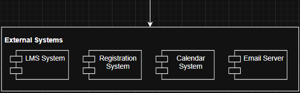
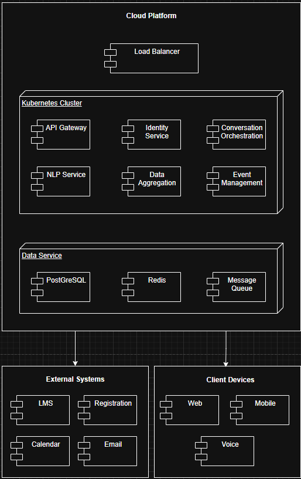

# Iteration 1

# Step 1: Review Inputs

## **Design Purpose**

This is a greenfield design for the AI-Powered Digital Assistant Platform (AIDAP). This is a new system to be created from scratch to address inefficiencies within current university systems.  

## **Business Case**

The current university systems in place are very disconnected and inefficient at relaying information outward. Communication is mostly done through LMS, Emails, and Web portals, which can be very time consuming for quick questions and great concerns. A fix to this problem would be the implementation of an AI-Powered Digital Assistant Platform (AIDAP) that fixes this problem by giving users a unified, quick and interactive interface by leveraging the power of AI.  

## **Primary Functional Requirements**

The key functional drivers for the architecture

* R1: Conversational access to institutional data and services  
* R3: Integration with existing data sources (LMS, Registration System, Calendars)  
* R4: Support both text and voice interaction modes  
* R5: Use AI models to interpret natural language queries  
* R6: Generate responses using both stored knowledge and live data  
* R7: Deployable as a cloud-native, scalable service

### Use Cases

| ID | Description | Associated Requirement ID |
| :---- | :---- | :---- |
| UC-1: Retrive lecture annoncement | A student interacts with AIDAP to learn about any new announcements from their lecture. The system returns the announcements to the student | R1, R3, R5, R6, RS1, RS2, RS8, RS9, RS10 |
| UC-2: View Class Analytics | A lecturer asks AIDAP for a summary of student performance, like average grade, attendance, and engagement. AIDAP retrieves and aggregates data from the LMS to present analytics. | R1, R3, R5, RL3, RL6, RL7 |
| UC-3: System Monitoring and Maintenance | The system maintainer monitors the latency, errors and model performance via dashboards and allows deployments of updates with zero downtime. | R7, RM1, RM2, RM4 |
| UC-4: Manage Notifications | A student or lecturer configures and receives notifications for deadlines, announcements, and events through text or voice. AIDAP delivers personalised updates via user-controlled preferences. | R2, R4, RS2, RS6, RL4 |

### Quality Attribute Scenarios

| ID | Quality Attribute | Scenario | Associated Use Case |
| :---- | :---- | :---- | :---- |
| QA-1 | Performance | AIDAP should respond to the user within 2 seconds under any conditions to ensure the conversation is seamless. (RS10) | UC-1 |
| QA-2 | Privacy | AIDAP should conform to university privacy policies and not disperse private data. (RA2, RA5, R8) | UC-3 |
| QA-3 | Maintainability | Allowing maintainers to update models, APIs, and configurations without downtime (RM1) | UC-3 |
| QA-4 | Availability/Scalability | AIDAP must remain available 99.5% of the time per month (RS11) and handle up to 5000 concurrent users without performance degradation (RA7) | UC-1, UC-2, UC-3, UC-4 |
| QA-5 | Usability | When a new user interacts with AIDAP, the interface guides them intuitively using conversational cues and context-aware responses. (RS12) | UC-4 |

### Constraints

| ID | Constraint |
| :---- | :---- |
| CON-1 | Must handle up to 5000 concurrent users. (RA7) |
| CON-2 | Must be available to use 99.5% time per month. (RS11, RA6) |
| CON-3 | Must use the institution’s Single Sign-On system. (RS7) |
| CON-4 | Must perform automatic backups and support disaster recovery. (RA6, RM6) |
| CON-5 | Must be deployable as a cloud-native service. (R7) |
| CON-6 | Must comply with data retention and encryption standards (R8, RA2, RA5) |

Concerns

| ID | Concern |
| :---- | :---- |
| CRN-1 | Protecting User data and privacy through communication with AI to comply with school regulations. |
| CRN-2 | The system must preserve data integrity across all platforms when accessing data |
| CRN-3 | Require a secure authorisation for some data to prevent classified information from being leaked. |
| CRN-4 | Allowing the AI to not take longer than 2 seconds to come up with a response to maintain efficiency. |
| CRN-5 | Integration complexity with multiple external systems (LMS, Registration, Calendar, Email) requires robust error handling and fallback mechanisms. |
| CRN-6 | AI model selection and cost management \- need to balance model performance, latency, and operational costs. |

---

# Step 2: Establish Iteration Goal

## **Iteration Goal**

The goal of the first iteration is to create the overall architectural system and design for the Aidap application while highlighting important qualities 

## **Drivers Selected for Iteration 1:**

### Functional Drivers:

* UC-1: Retrieve lecture announcement  
  Allows student interaction with system to require fast response times and reliable data access.  
* UC-2: View Class Analytics  
  Requires LMS integration, authentication, authorisation, and consistent API communication to be able to view analytics of classroom.  
* UC-3: System Monitoring and Maintenance  
  Requires maintence to be quick and efficient and for the system to be monitored quickly.
* UC-4: Manage Notifications  
  Requires event-driven architecture and personalised delivery mechanisms tailored for the end user.

### Quality Attribute Drivers:

* QA-1: Performance  
  Requires a 2 second response time for user interaction and component interaction patterns.  
* QA-2: Privacy  
  Create checks that handle data, logging, access control, and encryption.  
* QA-3: Modifiability  
  Allow app to be closed for modification and open to extension seen in SOLID principles 
* QA-4: Availability/Scalability  
  Allow Registration and exam periods top be scaleable with large amounts of users (5000 concurrent)

### Constraint Drivers:

* CON-1: 5000 Concurrent users  
  Allows resource allocation and infrastructure deployment for concurrent users across the system.  
* CON-2: 99.5% uptime per month
  Allows for system maintance to be done quickly so that uptime remains high
* CON-3: University SSO authentication  
  Dictates authentication for users and admins so that secure data is authenticated.
* CON-4: Automatic backups and data recovery  
  Create backup automation meeting with requirements and recovery procedure design.  
* CON-5: Cloud-native deployment  
  deploys services to the app to use technologies and infrastructure from web based cloud. 
* CON-6: Data retention and encryption standards
  secure data storage design, backup procedures, encryption implementation, and lifecycle management.

# Step 3: Elements to decompose

For iteration 1, the system is treated as a single architectural element

## **Element Selected for Decomposition**

AIDAP System (Complete System)

The goal of this iteration is to establish the overall structure of the AIDAP system. This means the system as a whole is selected for initial decomposition into major subsystems and layers

# Step 4: Choose Design Concepts
For the system we decided to chose a Rich Internet Application architecture the reasons for this is because by using a Rich Internet Application architecture we can easily meet a ton of quality, concerns and constraint drivers. This includes cross-platform application (CON-3, QA-6) and a user graphic interface (QA-4). We can also use create a backend server that is capable of replying to user queries even when the application is under load (QA-1, QA-3). This architecture also supports an easily modifiable server-side through a layered-architecture, giving it great modifiability (QA-7).

The reason as to why we choose this over other alternatives is because it matched a lot of the quality attributes and design constraints and allocated a balance between the two in this iteration.

# Step 5: Instantiate Architectural Elements, Allocate Responsibilities, and Define Interfaces
## Step 5: Instantiate Architectural Elements (Rich Internet Application)
The Rich Internet Application can be broken down into 3 different layers. These layers are the client side, server side and data side.

### Client-Side
**1. UI Layer**
- Renders the chat interface, menus, and pages.
- Captures user input (text or voice).
**2. Client Controller**
- Handles UI events.
- Sends user messages to the backend.
- Updates the UI with server responses.
**3. Session & State**
- Stores user session info and basic conversation state in the browser.
- Keeps track of the current conversation ID.
**4. API Client**
- Sends HTTP requests to the API Gateway.
- Adds authentication tokens.
- Parses server responses.
**5. Client Cache**
- Stores small pieces of data locally (e.g., last few messages, course list).
- Reduces API calls and improves responsiveness.
### Server-Side Components
**1. API Gateway**
- Entry point for all browser requests.
- Validates tokens and routes calls to backend services.
**2. Identity Service**
- Validates SSO login.
- Returns user roles and access tokens.
**3. Conversation Service**
- Processes user queries.
- Calls NLP service and assembles the final response.
**4. NLP Service**
- Interprets natural language.
- Extracts intent and entities from the user message.
**5. Data Aggregation Service**
- Retrieves academic data from LMS, Registration, and Calendar systems.
**6. Analytics Service**
- Provides instructor analytics data (averages, trends).
**7. Notification Service**
- Manages user notification settings and sends event updates.
### Data-Side Components
**1. primary Database**
- Captures and stores data from users, staffs and teachers.
- allows views to see the data.
**2. Data validationm**
- Validates NLP query to be working
- checks input and access requirments
### Interfaces
**Client -> Server**
- `/api/chat` — send message, get response  
- `/api/analytics` — get class analytics  
- `/api/notifications` — manage notifications  
- `/api/auth` — authenticate user session  

# Step 6: Sketch Views and Record Design Decisions

### Client Side

**Presentation Layer**
- Elements: UI Modules, Controllers, Chat Interface
- Responsibility: Handles rendering of user interface and user interaction, which includes displaying the interface and capturing user input.

**Business Layer**
- Elements: Session Management, Context Storage, Input Validation, Message Preprocessing
- Responsibility: Manages the client-side logic which includes maintaining the user session state, storing the conversation context, and validating and preprocessing messages before sending to server.

**Data Layer**
- Elements: Data Access Module, Local Cache
- Responsibility: Handles communication with the server and stores frequently accessed data locally to improve speed and performance.

---

### Server Side

**Service Interface Layer**
- Elements: API Gateway, Identity & Access Service, Service Endpoints
- Responsibility: Is the entry point for all requests. Handles routing, authentication, SSO integration, rate limiting, and exposes the REST and GraphQL APIs.

**Application Services Layer**
- Elements: Conversation Orchestration, Natural Language Processor, Analytics Processing, Data Aggregation, Event Management, Operational Services
- Responsibility: Core application logic including AI-powered conversation processing, data aggregation from external systems, notification handling, and system monitoring.

**Business Layer**
- Elements: Business Rules, Domain Entities, Workflow Orchestration
- Responsibility: Implements domain-specific rules, manages core domain objects (Student, Course, Announcement), and coordinates complex business workflows.

**Data Layer**
- Elements: Data Access Layer, External System Adapters, Distributed Cache Manager
- Responsibility: Handles database operations, connections to external university systems, and caching for performance optimization.

---

### External Systems

- Elements: LMS System, Registration System, Calendar System, Email Server
- Responsibility: University systems that AIDAP integrates with to retrieve courses, schedules, events, and deliver notifications.

**Load Balancer**
- Responsibility: Distributes traffic across servers, provides SSL termination and DDoS protection.

**Kubernetes Cluster**
- Elements: API Gateway, Identity Service, Conversation Orchestration, NLP Service, Data Aggregation, Event Management
- Responsibility: Hosts all application services with auto-scaling, rolling updates, and container orchestration.

**Data Services**
- Elements: PostgreSQL, Redis, Message Queue
- Responsibility: Provides constant storage, caching, and asynchronous event processing.

**External Systems**
- Elements: LMS, Registration, Calendar, Email, University SSO
- Responsibility: University infrastructure for user data and authentication.

**Client Devices**
- Elements: Web Browser, Mobile App, Voice Assistant
- Responsibility: User access points for interacting with the AIDAP.

# Step 7: Analysis of Current Design

## **Driver Analysis Table**

| Driver | Not Addressed | Partially Addressed | Completely Addressed | Design Decisions Made |
| :---- | ----- | ----- | ----- | :---- |
| UC-1: Retrieve lecture announcement |  |  | ✔ | Layered architecture establishes Conversation Orchestration, NLP Service, and Data Aggregation to support query processing and data retrieval from LMS. |
| UC-2: View Class Analytics |  |  | ✔ | Analytics Processing component aggregates data from external systems. Data Aggregation and External System Adapters enable LMS integration. |
| UC-3: System Monitoring and Maintenance |  | ✔ |  | Operational Services provides monitoring capabilities. Kubernetes supports zero-downtime deployment. CI/CD pipeline details not yet defined. |
| UC-4: Manage Notifications |  |  | ✔ | Event Management service with Message Queue enables asynchronous notification processing and multi-channel delivery. |
| QA-1: Performance  |  | ✔ |  | Distributed Cache Manager and Local Cache improve response times. Specific caching strategies and AI model optimization not yet detailed. |
| QA-2: Privacy |  | ✔ |  | Identity & Access Service provides SSO and RBAC. Detailed encryption, data masking, and audit logging not yet specified. |
| QA-3: Modifiability |  |  | ✔ | Layered architecture and modular services allow independent updates. Kubernetes enables rolling deployments. |
| QA-4: Availability/Scalability |  | ✔ |  | Kubernetes cluster with Load Balancer supports scaling. Specific auto-scaling policies and failover procedures not yet defined. |
| QA-5: Usability |  |  | ✔ | Chat Interface, UI Modules, and Controllers in Presentation Layer support intuitive conversational design. |
| CON-1: 5000 concurrent users |  | ✔ |  | Load Balancer and Kubernetes provide scaling foundation. Load testing and capacity planning not yet performed. |
| CON-2: 99.5% uptime |  | ✔ |  | Kubernetes and PostgreSQL replication support high availability. Specific SLAs and failover testing not defined. |
| CON-3: SSO authentication |  |  | ✔ | Identity & Access Service integrates with University SSO. API Gateway enforces authentication on all requests. |
| CON-4: Backup and disaster recovery |  | ✔ |  | PostgreSQL supports replication. Specific backup schedules and recovery procedures not yet defined. |
| CON-5: Cloud-native deployment |  |  | ✔ | Kubernetes-based deployment on cloud platform fully satisfies this constraint. |
| CON-6: Data retention and encryption | ✔ |  |  | No specific decisions on encryption standards, key management, or retention policies have been made. |
| CRN-1: Privacy compliance |  | ✔ |  | SSO and RBAC provide foundation. Detailed compliance measures need documentation. |
| CRN-2: Data integrity |  | ✔ |  | Data Access Layer manages transactions. Cross-system consistency needs further design. |
| CRN-3: Secure authorization |  |  | ✔ | Identity & Access Service implements RBAC. API Gateway enforces authorization. |
| CRN-4: AI response time |  | ✔ |  | Caching helps performance. AI model optimization and timeout strategies need definition. |
| CRN-5: Integration complexity |  | ✔ |  | External System Adapters isolate dependencies. Error handling and circuit breakers need detailed design. |
| CRN-6: AI cost management | ✔ |  |  | No decisions on AI model selection, usage monitoring, or cost optimization. |
