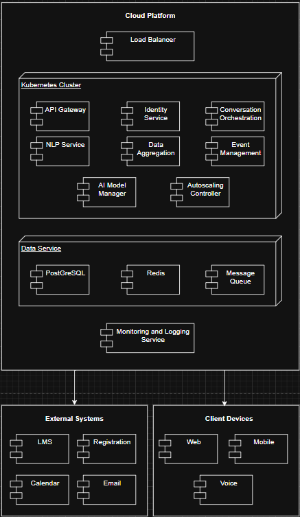

# Iteration 3

This iteration focuses on one part of the Backend Processing Layer from Iteration 2: the **AI Service (NLP Engine)**. Here we treat it as its own **AI Processing Subsystem**, and decompose it further to satisfy performance, reliability, security/privacy, and maintainability drivers for UC-1 (Retrieve Lecture Announcement) and UC-2 (View Class Analytics).

---

## Step 1 – Use Cases, Quality Attributes, and Constraints

### 1.1 Use Cases (for this element)

#### UC-1A – Process Natural Language Query (inside AI Processing Subsystem)

- **Primary actor:** Conversation Service (from Backend Processing Layer)
- **Goal:** Process a user's natural language query and generate an accurate, personalized response within the 2-second response time requirement.

**Main flow:**

1. Conversation Service calls `processQuery(userId, queryText, context)` with authenticated user ID and query context.
2. The AI Processing Subsystem loads the **active model configuration** from the AI Model Manager.
3. It performs **intent classification** to determine query type (schedule, grades, announcements, etc.).
4. It retrieves **relevant cached data** from the Cache Service if available.
5. It generates a **response** using the NLP model with user context for personalization.
6. It applies **response validation** to ensure accuracy and appropriateness.
7. It returns a **Response DTO** to the Conversation Service with the generated answer and confidence score.

**Related requirements:**

- General: R1 (conversational access), R5 (AI response handling), R7 (operational improvements).
- Students: RS1, RS10 (student queries & personalized responses).
- Quality attributes: QA-1 (Performance), QA-3 (Maintainability), QA-5 (Reliability).

---

#### UC-2A – Generate Analytics Summary (inside AI Processing Subsystem)

- **Primary actor:** Dashboard Service (from Backend Processing Layer)
- **Goal:** Process analytics data and generate natural language summaries for class performance, attendance trends, and engagement metrics.

**Main flow:**

1. Dashboard Service calls `generateAnalyticsSummary(courseId, metricType, timeRange)` with course and metric parameters.
2. The AI Processing Subsystem retrieves **raw analytics data** from the Cache Service or external integrations.
3. It applies **data aggregation and analysis** rules based on the metric type.
4. It generates a **natural language summary** using the NLP model.
5. It applies **privacy filters** to ensure role-appropriate data exposure.
6. It returns an **AnalyticsSummaryDTO** to the Dashboard Service.

**Related requirements:**

- General: R1, R3 (integrations), R5 (AI response handling).
- Lecturers: RL3, RL6, RL7 (class analytics, performance tracking).
- Quality attributes: QA-1 (Performance), QA-2 (Privacy), QA-5 (Reliability).

---

### 1.2 Quality Attributes

| ID | Quality Attribute | Description |
|----|-------------------|-------------|
| QA-1 | Performance & Scalability | Must return AI-generated responses in ≤ 2 seconds under normal load and scale with autoscaling to handle 5,000 concurrent users. |
| QA-2 | Reliability & Fault Tolerance | Must degrade gracefully when AI models are slow or unavailable, with fallback responses and automatic recovery. |
| QA-3 | Security & Privacy | Must enforce data minimization in AI processing, avoid exposing sensitive data in responses, and maintain audit trails. |
| QA-4 | Maintainability | Must support model versioning, A/B testing, and zero-downtime updates through the AI Model Manager. |

---

### 1.3 Constraints

| ID | Constraint Title | Description |
|----|------------------|-------------|
| CON-1 | Response Time Limit | All AI processing must complete within 2 seconds to meet user experience requirements. |
| CON-2 | Model Access via Model Manager | May only access AI models through the **AI Model Manager** component for version control. |
| CON-3 | Cache-First Data Access | Must check **Cache Service** before making external API calls to reduce latency. |
| CON-4 | Cloud-Native, Stateless Design | AI processing components must be stateless and horizontally scalable. |
| CON-5 | Logging and Monitoring | All AI operations must be logged to the **Monitoring and Logging** service for observability. |

---

## Step 2 – Element Name and Responsibilities

### 2.1 Selected Element

- **Element name:** AI Processing Subsystem
- **Parent element (from Iteration 2):** Backend Processing Layer
- **External collaborators:**
  - Conversation Service (UC-1: Retrieve Lecture Announcement)
  - Dashboard Service (UC-2: View Class Analytics)
  - Cache Service
  - AI Model Manager
  - Monitoring and Logging Service
  - External AI Provider (if applicable)

In Iteration 2 we treated this as a single "AI Service (NLP Engine)."
In Iteration 3 we zoom in and treat it as its own subsystem so we can show its internal structure.

---

### 2.2 Responsibilities of the Element

The AI Processing Subsystem is responsible for the following:

1. **Process natural language queries**
   - Offer a simple API like `processQuery(userId, queryText, context)` that the Conversation Service can call.
   - Perform intent classification, entity extraction, and response generation.
   - Supports UC-1A: Process Natural Language Query.

2. **Generate analytics summaries**
   - Offer APIs such as `generateAnalyticsSummary(courseId, metricType, timeRange)` for the Dashboard Service.
   - Transform raw data into human-readable insights and summaries.
   - Supports UC-2A: Generate Analytics Summary.

3. **Manage model lifecycle through Model Manager**
   - Act as the **only** way that the Backend Processing Layer interacts with AI models.
   - Support model versioning, switching, and rollback without service interruption.
   - Enable A/B testing of different model versions.

4. **Optimize performance through caching integration**
   - Check Cache Service for previously computed responses or frequently requested data.
   - Cache AI responses where appropriate to reduce inference latency.
   - Respect cache TTL and invalidation policies.

5. **Apply response validation and safety checks**
   - Validate AI-generated responses for accuracy and appropriateness.
   - Filter out potentially harmful or incorrect information.
   - Ensure responses respect user roles and data access permissions.

6. **Support monitoring and observability**
   - Log all AI operations (queries, inference times, model versions) to the Monitoring and Logging service.
   - Track performance metrics (latency, throughput, error rates) for operational visibility.
   - Enable alerting when performance degrades or errors spike.

7. **Expose stateless APIs**
   - Keep the public interface of this subsystem stateless for horizontal scaling.
   - Store no session state within the subsystem; rely on external stores for persistence.

---

## Step 3 – Architectural Patterns and Styles

### 3.1 Overview

In Iteration 3 we are looking inside the **AI Processing Subsystem** and choosing the main patterns we will use to structure it.

The goals are to:

- Keep a **simple public interface** for the rest of the system.
- Separate **AI inference** from **data access** and **response formatting**.
- Make it easy to update or swap models without affecting other components.
- Support our key quality attributes: performance, reliability, maintainability, and security.

---

### 3.2 Patterns Used Inside This Subsystem

1. **Facade Pattern (external view)**
   - The subsystem exposes a small set of methods such as:
     - `processQuery(userId, queryText, context)`
     - `generateAnalyticsSummary(courseId, metricType, timeRange)`
     - `getModelStatus()`
   - These are grouped into an **AI Facade API** so the rest of the Backend Processing Layer doesn't need to know about internal components.
   - This keeps the public interface clean and stable.

2. **Strategy Pattern (model selection)**
   - The **Model Selector** component uses the Strategy pattern to choose which AI model to use based on:
     - Query type (simple lookup vs. complex reasoning).
     - Current load and latency targets.
     - A/B testing configuration.
   - This allows us to swap models or add new ones without changing the calling code.

3. **Chain of Responsibility (processing pipeline)**
   - Query processing flows through a pipeline:
     - Intent Classifier → Entity Extractor → Response Generator → Response Validator
   - Each stage can pass to the next or short-circuit (e.g., if intent is unclear, ask for clarification).
   - This makes it easy to add or remove processing stages.

4. **Repository Pattern (cache and data access)**
   - **Cache Repository** handles all interactions with the Cache Service.
   - **Context Repository** fetches user context needed for personalization.
   - These repositories hide storage details from the AI processing logic.

5. **Circuit Breaker Pattern (fault tolerance)**
   - The **Inference Engine** uses a circuit breaker when calling the AI model.
   - If the model is slow or failing, the circuit opens and fallback responses are used.
   - This prevents cascading failures and maintains partial availability.

6. **Observer Pattern (monitoring and metrics)**
   - An **AI Metrics Collector** observes all AI operations.
   - It collects latency, throughput, and error metrics without coupling to the core logic.
   - Metrics are sent to the Monitoring and Logging service asynchronously.

---

### 3.3 How These Patterns Support Our Drivers

- **Performance & Scalability (QA-1)**
  - Strategy pattern allows selecting lighter models for simple queries.
  - Cache Repository reduces redundant AI inference calls.
  - Stateless Facade API enables horizontal scaling.

- **Reliability & Fault Tolerance (QA-2)**
  - Circuit Breaker prevents model failures from crashing the whole system.
  - Chain of Responsibility allows graceful degradation at each stage.
  - Fallback responses maintain user experience during outages.

- **Security & Privacy (QA-3)**
  - Response Validator filters sensitive information before returning responses.
  - Context Repository ensures only authorized data reaches the AI model.
  - AI Metrics Collector logs anonymized data for compliance.

- **Maintainability (QA-4)**
  - Strategy pattern makes model updates seamless.
  - Chain of Responsibility allows adding new processing stages without refactoring.
  - Facade pattern isolates internal changes from external callers.

---

## Step 4 – Decomposition of the AI Processing Subsystem

In this step we break the **AI Processing Subsystem** into smaller internal components and explain what each one does and how they relate to Iterations 1 and 2.

---

### 4.1 Subcomponents and Responsibilities

Below are the main subcomponents we introduce inside this subsystem.

| Subcomponent | Main Responsibilities |
|--------------|----------------------|
| AI Facade API | Public entry point for other services (Conversation, Dashboard). Exposes methods like `processQuery` and `generateAnalyticsSummary`. |
| Intent Classifier | Analyzes user queries to determine intent (schedule, grades, announcements, general question). |
| Entity Extractor | Extracts key entities from queries (course names, dates, assignment names). |
| Model Selector | Chooses the appropriate AI model based on query complexity, load, and A/B testing rules. |
| Inference Engine | Executes the actual AI model inference, with circuit breaker for fault tolerance. |
| Response Generator | Formats AI model output into user-friendly responses with personalization. |
| Response Validator | Validates responses for accuracy, appropriateness, and data privacy compliance. |
| Cache Repository | Handles all interactions with the Cache Service for response caching. |
| Context Repository | Fetches user context and preferences needed for personalized responses. |
| AI Metrics Collector | Collects and sends performance metrics to the Monitoring and Logging service. |

A quick summary of each:

1. **AI Facade API**
   - This is the "front door" of the subsystem.
   - Called by:
     - Conversation Service (for query processing).
     - Dashboard Service (for analytics summaries).
   - It validates inputs and delegates to the appropriate internal components.

2. **Intent Classifier**
   - First stage of the processing pipeline.
   - Determines what the user is asking about:
     - Schedule queries ("When is my next class?")
     - Grade queries ("What's my grade in CS101?")
     - Announcement queries ("Any new announcements?")
     - General questions
   - Outputs an intent label and confidence score.

3. **Entity Extractor**
   - Second stage of the processing pipeline.
   - Extracts structured entities from the query:
     - Course names/codes
     - Dates and time references
     - Assignment or exam names
     - Instructor names
   - Outputs a structured entity map for downstream processing.

4. **Model Selector**
   - Implements the Strategy pattern for model selection.
   - Considers:
     - Query complexity (simple lookup vs. complex reasoning).
     - Current system load and latency budget.
     - A/B testing configuration from AI Model Manager.
   - Returns a model reference for the Inference Engine to use.

5. **Inference Engine**
   - Core component that executes AI model inference.
   - Features:
     - Circuit breaker for fault tolerance.
     - Timeout handling (must complete within latency budget).
     - Retry logic with exponential backoff.
   - Communicates with AI Model Manager to get the selected model.

6. **Response Generator**
   - Takes raw AI model output and formats it for users.
   - Applies personalization:
     - User's preferred language/locale.
     - Date/time format preferences.
     - Course focus and priorities.
   - Generates natural language responses.

7. **Response Validator**
   - Final quality gate before responses leave the subsystem.
   - Checks:
     - Response accuracy (sanity checks on dates, numbers).
     - Privacy compliance (no unauthorized data exposure).
     - Appropriateness (no harmful content).
   - Can reject responses and trigger fallback behavior.

8. **Cache Repository**
   - Manages cache interactions.
   - Responsibilities:
     - `checkCache(queryHash)` - Look for cached responses.
     - `cacheResponse(queryHash, response, ttl)` - Store responses.
     - `invalidateCache(pattern)` - Clear stale entries.
   - Reduces AI inference load for repeated queries.

9. **Context Repository**
   - Fetches context needed for personalization.
   - Retrieves:
     - User profile and preferences.
     - Recent interaction history.
     - Current course enrollments.
   - Interfaces with User Profile Store and Conversation History Store.

10. **AI Metrics Collector**
    - Observes all AI operations and collects metrics.
    - Tracks:
      - Query processing latency (end-to-end and per-stage).
      - Model inference times.
      - Cache hit/miss rates.
      - Error rates and types.
    - Sends metrics to Monitoring and Logging service asynchronously.

---

### 4.2 Mapping Back to Iterations 1 and 2

To show continuity with earlier iterations:

- In **Iteration 1** we had:
  - A general "AI/NLP Engine" as part of the system architecture.
  - Cache Service, Monitoring Service as supporting infrastructure.

- In **Iteration 2** we introduced:
  - **AI Service (NLP Engine)** in the Backend Processing Layer.
  - **AI Model Manager** for model versioning and updates.
  - **Cache Service** for response caching.
  - **Monitoring and Logging** for observability.

Now, in **Iteration 3**:

- The "AI Service (NLP Engine)" from Iteration 2 is realized by:
  - `AI Facade API`
  - `Intent Classifier`
  - `Entity Extractor`
  - `Model Selector`
  - `Inference Engine`
  - `Response Generator`
  - `Response Validator`
  - `Cache Repository`
  - `Context Repository`
  - `AI Metrics Collector`

The AI Model Manager from Iteration 2 remains external to this subsystem but is now connected via the Model Selector and Inference Engine components.

---

# Step 6: Sketch Views and Record Design Decisions

### Design Decisions Added in Iteration 3

* Introduced caching to support performance needs  
* Added load balancing and autoscaling for availability  
* Strengthened API Gateway to support security and privacy  
* Added AI Model Manager for maintainability  
* Added Monitoring and Logging to support operational visibility  
* Reduced dependency on external systems via caching and retry logic  

---
## Step 6 – Interface Specifications

---

## Step 7 – Analysis of Current Design

