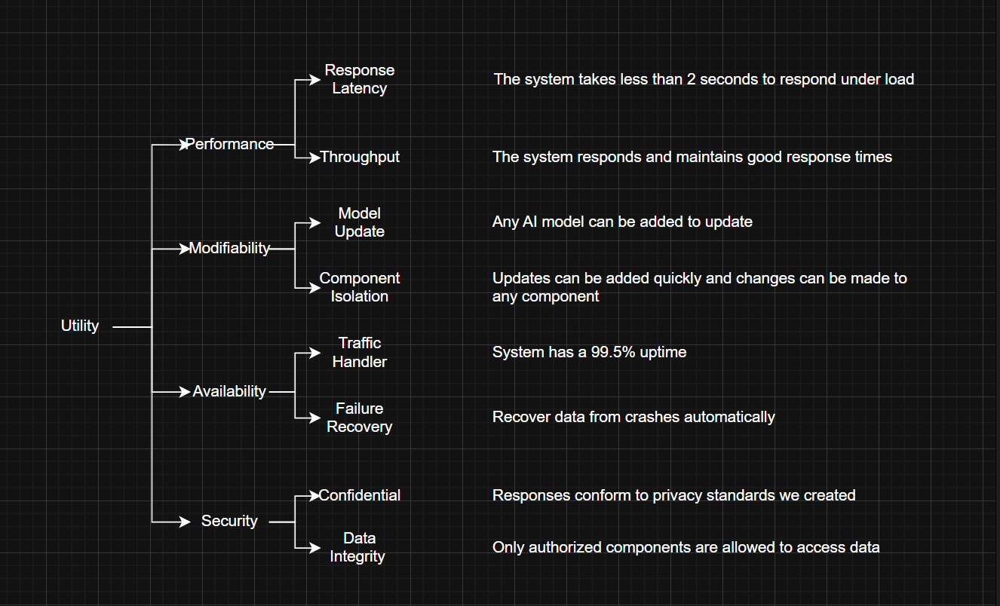

# ATAM Analysis

# Risks

Potential architectural decisions that might cause problems.

Risk 1: Too Many Processing Steps
Description: We are using a chain of steps (Intent → Entity → Response → Validator) to process every request. If these steps add up to take too long we will fail our 2-second speed limit.

Risk 2: Dependent on External Data Speed
Description: Because our servers don't remember user history we have to fetch user details from the database for every single request. If the database is slow, the AI Service becomes slow.

Risk 3: AI Leaking Private Data
Description: We rely on a Response Validator to catch bad data. However, if the AI makes up facts or leaks private info that the Validator doesn't recognize we could violate privacy rules.

# Non-Risks

Safe decisions that we know will work well.

Non-Risk 1: Using a Facade API
Description: Hiding the complex AI logic behind a simple Facade API is a safe choice. It guarantees that changes to the AI internals won't break the Conversation or Dashboard services.

Non-Risk 2: Circuit Breaker Pattern
Description: Using a Circuit Breaker is a standard safety net. We know it works to stop a single model failure from crashing the entire system.

Non-Risk 3: Repository Pattern
Description: Using Repositories to handle data fetching is a standard low-risk way to keep our code clean and separate from the database logic.

# Sensitivity Points

Small changes here cause big reactions in the system.

Sensitivity Point 1: Model Speed
Description: Our performance depends heavily on the specific AI model we choose. Picking a model that is just too complex and bloated it can make us miss our 2-second target which is bad.

Sensitivity Point 2: Cache Hit Rate
Description: The system relies on finding answers in the cache so if users ask unique questions and we don't find them in the cache the system has to do the hard work every time which hurts performance.

Sensitivity Point 3: Validator Strictness
Description: The user experience is very sensitive to how strict our Validator is if we make the rules too tight it might make the AI might refuse to answer valid questions which could frustrate the users.

# Trade-off Points

Decisions where we gain one thing but lose another.

Trade-off 1: Intelligence vs. Speed
Description: A smarter AI model gives better answers but takes longer to think. We trade some intelligence to ensure we meet the "speed" (2-second limit).

Trade-off 2: Safety vs. Performance
Description: Adding the Response Validator step makes the system safer (better privacy), but it adds extra time to every request (worse latency).

Trade-off 3: Easy Scaling vs. Extra Network Calls
Description: Making the system stateless makes it easy to add more servers (scaling), but it forces us to make extra network calls to fetch user data every time (network overhead).

