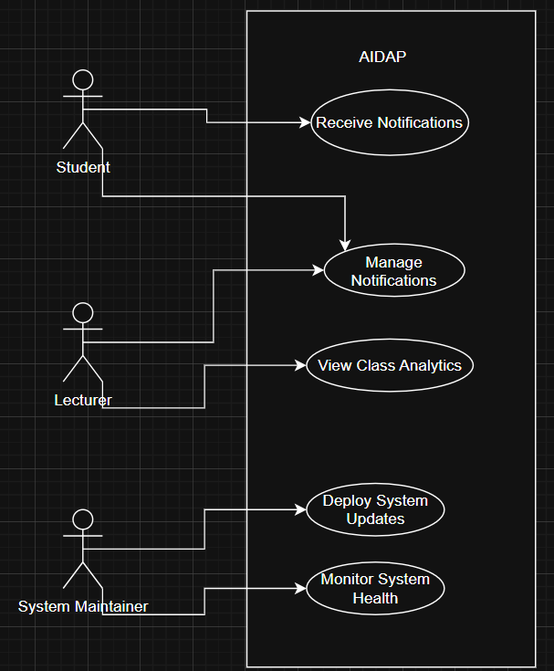

# Use Cases

| Use Case | Description | Associated Requirement ID |
|----------|-------------|----------------------------|
| **UC-1: Retrive lecture annoncement**| A student interacts with AIDAP to learn about any new annoncements from his lecture. The system returns the annoncement to the student. | R1, R3, R5, R6, RS1, RS2, RS8, RS9, RS10 |
| **UC-2: View Class Analytics** | A lecturer asks AIDAP for a summary of student performance like average grade, attendance, engagement. AIDAP retrieves and aggregates data from the LMS to present analytics. | R1, R3, R5, RL3, RL6, RL7 |
| **UC-3: System Monitoring and Maintenance**| The system maintainer monitors the latency, errors and model performance via dashboards and allowing deployments of updates with zero downtime. |R7, RM1, RM2, RM4 |
| **UC-4: Manage Notifications** | A student or lecturer configures and receives notifications for deadlines, announcements, and events through text or voice. AIDAP delivers personalized updates via user controlled preference. |R2, R4, RS2, RS6, RL4|

